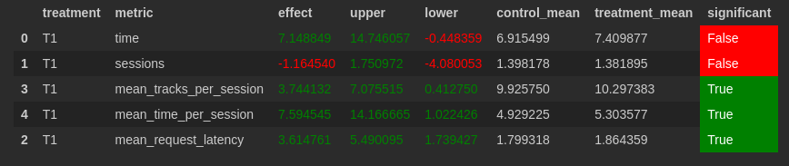

## Abstract
Модифицируем нейрорекоммендер Contextual так, чтобы он использовал в качестве fallback рекоммендер Indexed на основе LightFM. 
Fallback будем использовать помимо случаев из обычного Contextual еще и тогда, когда пользователю не понравился трек (т.е. `prev_track_time <= time_threshold`)
## Детали
Из нового только `self.fallback = indexed` и проверка `prev_track_time <= time_threshold` в начале `recommend_next`. `time_threshold` по умолчанию 0.6
## Результаты A/B эксперимента

По результатам A/B эксперимента метрика mean_time_per_session увеличилась на 7.59
## Запуск
Запускается все так же, как на семинарах, ничего дополнительно устанавливать не надо.
A/B тестирование так же в notebooks/Week1Seminar
```
python sim/run.py --episodes 1000 --config config/env.yml multi --processes 2
```